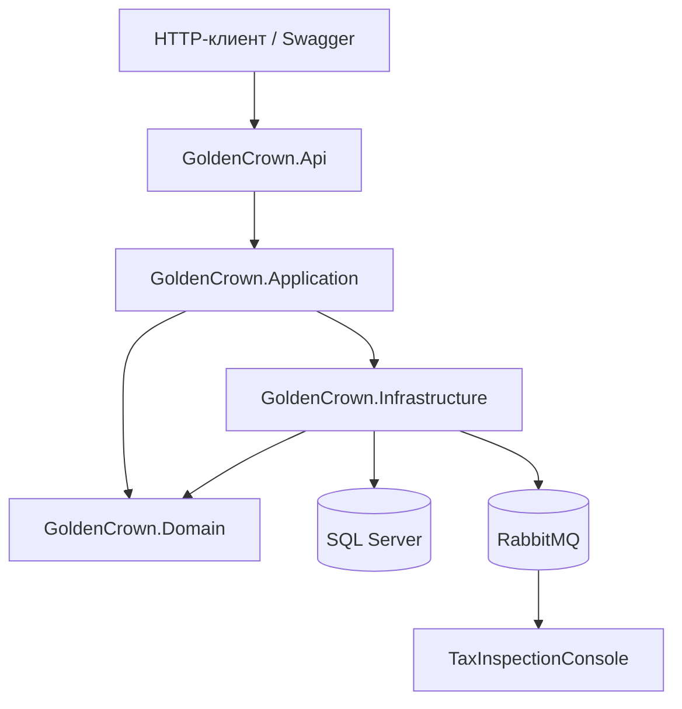

# Golden Crown

Учебный банковский бэкенд на **ASP.NET Core** и **.NET 10**: регистрация пользователей, токен-сессии, мультивалютные счета, финансовые операции и асинхронная отправка событий о переводах в **RabbitMQ**.

Проект демонстрирует типичный стек промышленной разработки: слоистая архитектура, **CQRS** через **MediatR**, **Entity Framework Core**, **FluentValidation**, кастомная авторизация, фоновые службы и контейнеризация.

---

## Содержание

- [Возможности](#возможности)
- [Архитектура](#архитектура)
- [Структура решения](#структура-решения)
- [Требования](#требования)
- [Быстрый старт](#быстрый-старт)
- [Запуск через Docker](#запуск-через-docker)
- [API](#api)
- [База данных](#база-данных)
- [RabbitMQ и Tax Inspection](#rabbitmq-и-tax-inspection)
- [Технологии](#технологии)

---

## Возможности

| Область | Описание |
|--------|----------|
| Пользователи | Регистрация, вход по логину и паролю |
| Сессии | Токен (GUID), срок жизни **1 час**, одна активная сессия на пользователя |
| Счета | У каждого пользователя **три счёта**: RUB, USD, EUR |
| Финансы | Баланс, пополнение, перевод другому пользователю, история операций |
| Безопасность | Защита финансовых эндпоинтов через `AuthorizationMiddleware` и атрибут `[MyAuthorize]` |
| Фоновые задачи | `SessionCleanupService` удаляет просроченные сессии каждые **10 минут** |
| События | При переводе публикуется `TransactionCreatedEvent` в RabbitMQ |
| Consumer | Консоль `GoldenCrown.TaxInspectionConsole` логирует переводы (имитация налоговой) |

---

## Архитектура



**Поток запроса:** контроллер → MediatR (команда/запрос) → обработчик в `Application` → `ApplicationDBContext` / `IMessageProducer`.

**Слои:**

- **GoldenCrown.Api** — HTTP API, middleware, валидаторы, AutoMapper, Swagger, миграции при старте.
- **GoldenCrown.Application** — бизнес-сценарии (CQRS): `UserRegister`, `UserLogin`, `GetBalance`, `Deposit`, `Transfer`, `GetTransactionHistory`.
- **GoldenCrown.Domain** — сущности: `User`, `Account`, `Session`, `Transaction`, константы валют.
- **GoldenCrown.Infrastructure** — EF Core, миграции, RabbitMQ producer.
- **GoldenCrown.TaxInspectionConsole** — подписчик на очередь событий переводов.

---

## Структура решения

```
GoldenCrown/
├── GoldenCrown.Api/                    # Web API (точка входа)
├── GoldenCrown.Application/            # MediatR handlers, DTO, события
├── GoldenCrown.Domain/                 # Доменные модели
├── GoldenCrown.Infrastructure/         # БД, RabbitMQ, миграции EF
├── GoldenCrown.TaxInspectionConsole/   # Consumer RabbitMQ
├── GoldenCrown.slnx
├── Dockerfile
└── docker-compose.yaml
```

---

## Требования

- [.NET 10 SDK](https://dotnet.microsoft.com/download)
- **SQL Server** (LocalDB, Express или контейнер)
- **Docker Desktop** (опционально, для полного стека)
- **RabbitMQ** (опционально, нужен для переводов с публикацией событий и для Tax Inspection Console)

---

## Быстрый старт

### 1. Клонирование

```bash
git clone <url-репозитория>
cd GoldenCrown
```

### 2. Строка подключения

В `GoldenCrown.Api/appsettings.json` настройте `ConnectionStrings:DefaultConnection`. Пример для LocalDB:

```json
{
  "ConnectionStrings": {
    "DefaultConnection": "Server=(localdb)\\MSSQLLocalDB;Database=GoldenCrownDB;Trusted_Connection=True;MultipleActiveResultSets=true"
  },
  "RabbitMQ": {
    "Hostname": "localhost",
    "Username": "guest",
    "Password": "guest"
  }
}
```

### 3. Миграции базы данных

Миграции применяются **автоматически** при запуске API (`Program.MigrateDatabase`). При необходимости можно выполнить вручную:

```bash
dotnet ef database update \
  --project GoldenCrown.Infrastructure \
  --startup-project GoldenCrown.Api
```

### 4. Запуск API

```bash
dotnet run --project GoldenCrown.Api
```

Профили из `launchSettings.json`:

| Профиль | URL |
|---------|-----|
| HTTP | http://localhost:5138 |
| HTTPS | https://localhost:7204, http://localhost:5138 |

**Swagger UI** (в режиме Development):  
`https://localhost:7204/swagger` или `http://localhost:5138/swagger`

### 5. Тестовые пользователи (seed)

После миграций в БД создаются пользователи:

| Логин | Пароль |
|-------|--------|
| Kostya | 123 |
| Mark | 1234 |
| Tom | 1235 |

У каждого — счета в валютах **RUB**, **USD**, **EUR** с нулевым балансом (кроме данных из seed, если вы их дополняли).

---

## Запуск через Docker

Поднимает API, SQL Server, RabbitMQ и консоль налоговой инспекции:

```bash
docker compose up -d --build
```

| Сервис | Назначение | Порт |
|--------|------------|------|
| `app` | Web API | http://localhost:5087 |
| `mssql` | SQL Server 2022 | 1433 |
| `rabbitmq` | Брокер + UI управления | 5672, **15672** (UI) |
| `tax-inspection-console` | Consumer событий переводов | — |

Миграции EF применяются при старте контейнера `app`.

Переменные окружения для API заданы в `docker-compose.yaml` (строка подключения к `mssql`, параметры RabbitMQ).

---

## API

Базовый префикс: `/api`.

### Авторизация

Эндпоинты `FinanceController` помечены `[MyAuthorize]`. Передавайте токен, полученный при логине, в заголовке:

```http
Authorization: <ваш-token-guid>
```

Токен действует **1 час** с момента входа. Просроченные сессии удаляются фоновой службой.

### Пользователи (без токена)

#### Регистрация

```http
POST /api/user/register
Content-Type: application/json

{
  "login": "alexey",
  "name": "Алексей",
  "password": "123456"
}
```

Создаёт пользователя и **три счёта** (RUB, USD, EUR).

**Ответ:** `200 OK` при успехе, `400` если логин занят или ошибка валидации.

#### Вход

```http
POST /api/user/login
Content-Type: application/json

{
  "login": "alexey",
  "password": "123456"
}
```

**Ответ при успехе:**

```json
{
  "token": "a1b2c3d4-e5f6-7890-1234-567890abcdef"
}
```

**Ответ при ошибке:** `401 Unauthorized`.

---

### Финансы (требуется токен)

Во всех запросах указывайте валюту: `RUB`, `USD` или `EUR`.

#### Баланс

```http
GET /api/finance/balance?Currency=RUB
Authorization: <token>
```

**Ответ:**

```json
{
  "balance": 2500.00
}
```

#### Пополнение

```http
POST /api/finance/Deposit
Authorization: <token>
Content-Type: application/json

{
  "amount": 500.00,
  "currency": "RUB"
}
```

Создаётся запись в истории транзакций (отправитель и получатель — один и тот же счёт).

#### Перевод

```http
POST /api/finance/transfer
Authorization: <token>
Content-Type: application/json

{
  "receiverLogin": "elena",
  "amount": 150.00,
  "currency": "RUB"
}
```

Проверки: получатель существует, достаточно средств на счёте в выбранной валюте. После успешного перевода в RabbitMQ отправляется `TransactionCreatedEvent`.

Типичные ответы: `200 OK`, `400` (недостаточно средств, пользователь не найден), `401` (нет или просрочен токен).

#### История транзакций

```http
GET /api/finance/History?From=2025-01-01&To=2025-12-31&Ofset=0&Limit=10
Authorization: <token>
```

Возвращает операции по всем счетам пользователя с фильтром по дате и пагинацией.

**Пример ответа:**

```json
[
  {
    "senderName": "Алексей",
    "receiverName": "Елена",
    "amount": 150.00,
    "createAt": "2025-05-04T10:00:00Z",
    "currency": "RUB"
  }
]
```

---

## База данных

СУБД: **Microsoft SQL Server**. Контекст: `ApplicationDBContext` (`GoldenCrown.Infrastructure`).

### Таблицы

| Таблица | Назначение |
|---------|------------|
| `users` | Пользователи (логин, имя, пароль) |
| `account` | Счета: баланс, `user_id`, `currency` |
| `session` | Сессии: `user_id` (PK), `token`, `expires_at` |
| `transaction` | Операции между счетами: сумма, валюта, дата |

### Связи

- Пользователь → много счетов (по одному на валюту).
- Пользователь → одна сессия (`user_id` — первичный ключ в `session`).
- Транзакция ссылается на счета отправителя и получателя (`sender_account_id`, `reciever_account_id`).

### Миграции

Файлы миграций: `GoldenCrown.Infrastructure/Database/Migrations/`.

Ключевые этапы схемы:

1. `InitialCreate` — базовые таблицы.
2. `SeeData` — начальные пользователи.
3. `Changing_Transaction` — переход транзакций на привязку к счетам.
4. `AccountCurrency` / `TransactionCurrency` — поддержка мультивалютности.

---

## RabbitMQ и Tax Inspection

При успешном **переводе** (`TransferCommand`) API публикует сообщение в очередь с именем типа события:

- Очередь / exchange: `TransactionCreatedEvent`
- Тело: JSON `{ senderId, receiverId, amount, currency }`

Сервис **GoldenCrown.TaxInspectionConsole** подписывается на ту же очередь и выводит в консоль данные перевода (учебная имитация внешней системы — «налоговой»).

Запуск consumer локально (при работающем RabbitMQ на `localhost`):

```bash
dotnet run --project GoldenCrown.TaxInspectionConsole
```

В Docker consumer стартует автоматически как сервис `tax-inspection-console`.

---

## Технологии

| Категория | Стек |
|-----------|------|
| Платформа | .NET 10, ASP.NET Core Web API |
| Данные | Entity Framework Core 10, SQL Server |
| Паттерны | CQRS, MediatR, Result-объекты |
| Валидация | FluentValidation |
| API-документация | Swagger / OpenAPI |
| Очереди | RabbitMQ.Client 7.x |
| Маппинг | AutoMapper |
| Инфраструктура | Docker, docker-compose |
| Фоновые задачи | `BackgroundService` |

---

## Разработка

### Сборка всего решения

```bash
dotnet build GoldenCrown.slnx
```

### Добавление миграции

```bash
dotnet ef migrations add <ИмяМиграции> \
  --project GoldenCrown.Infrastructure \
  --startup-project GoldenCrown.Api \
  --output-dir Database/Migrations
```

### Полезные файлы

- `GoldenCrown.Api/GoldenCrown.http` — примеры HTTP-запросов для IDE.
- `GoldenCrown.Api/Validators/` — правила FluentValidation для DTO.

---

## Лицензия и статус

Учебный проект. Пароли хранятся в открытом виде — **не используйте такой подход в production** без хеширования, HTTPS и полноценной аутентификации (JWT, Identity и т.д.).
